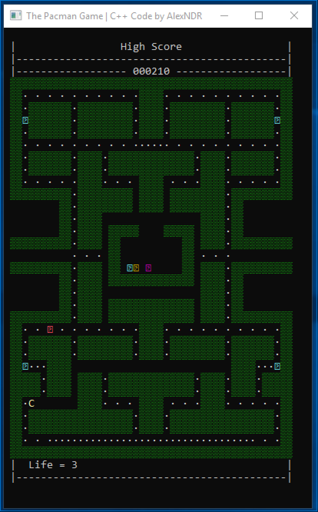

# Console Pacman game (demo)

[![Build status][actions build badge]][actions build link]

Little tiny console [Pacman](https://en.wikipedia.org/wiki/Pac-Man) game for Windows.

## Screenshots

## What works...

- Pacman can move trought maze
- Pacmac walks trougth maze until bump into wall or gamer turns him
- Pacmac chosing random way when bump into wall
- Energizer increasing game score by 50 units
- Ghosts moves by random algorithm
- Blinky ghost starts outside house and always try to catch Pacman
- Ghosts and Pacman can move trought tunnel
- When Pacmac catched, game will increase speed

## What not works...

- Ghosts arent have themself prioritized behavior
- Pacman not able to use Energizer for attack Ghosts
- Ghosts except Blinky are not chasing Pacman
- Ghosts arent have free-walking mode when the game start

## Win game Condition

- The objective of the game is to accumulate as many points as possible by eating dots. Collect 240 points to win the game.

## Game over conditions

- The Pacman is catched up by one of the Ghost. (3 lives / per game)

## Controls:

- Use Keyboard arrows to change Pacman direction

[actions build badge]: https://github.com/AlexNDRmac/ConsolePacman/workflows/Build%20and%20Test/badge.svg "Build status"
[actions build link]: https://github.com/AlexNDRmac/ConsolePacman/actions?query=workflow%3A%22Build+and+Test%22
